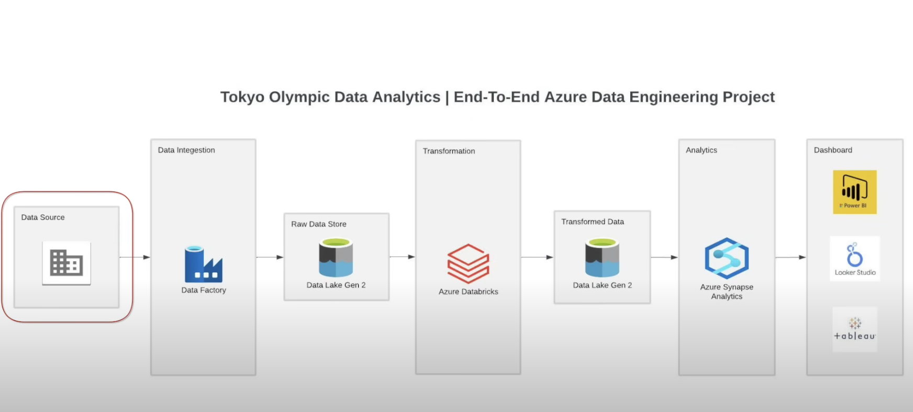

# Data Engineering Tokyo Olympic Data Analysis Project
## Project Overview
This project involves designing and implementing a modern data pipeline using Azure services for ingesting, transforming, and analyzing data. The solution integrates Azure Data Factory, Azure Data Lake Storage Gen2, Azure Databricks, and Azure Synapse Analytics to automate data flow and enable real-time insights.

## Data Pipeline Architecture

## Dataset used 
https://www.kaggle.com/datasets/arjunprasadsarkhel/2021-olympics-in-tokyo

## Data Pipeline steps
- Data Extraction
  - Extracted data from GitHub using an HTTP connection.
  - Used Azure Data Factory (ADF) to copy data to Azure Data Lake Gen2 (Raw folder).
- Data Transformation
  - Created a mount point in Databricks pointing to the Raw folder in Azure Data Lake Gen2.
  - Performed data transformations in Databricks and loaded the processed data into the Processed folder in Azure Data Lake Gen2.
- Data Loading & Analytics
  - Created a database in Azure Synapse Analytics.
  - Created tables within the Azure Synapse database.
  - Executed SQL analytical scripts to generate insights.

## Technologies Used
1. Azure Data Factory: For data extraction and migration.
2. Azure Data Lake Gen2: For data storage.
3. Databricks (with PySpark): For data transformation.
4. Azure Synapse Analytics: For data analysis and creating views.
5. Programming Languages: SQL, PySpark.
